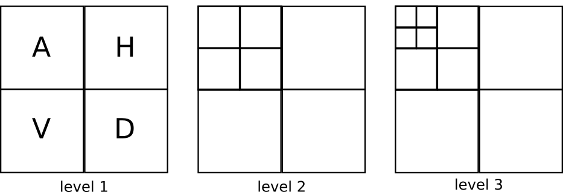
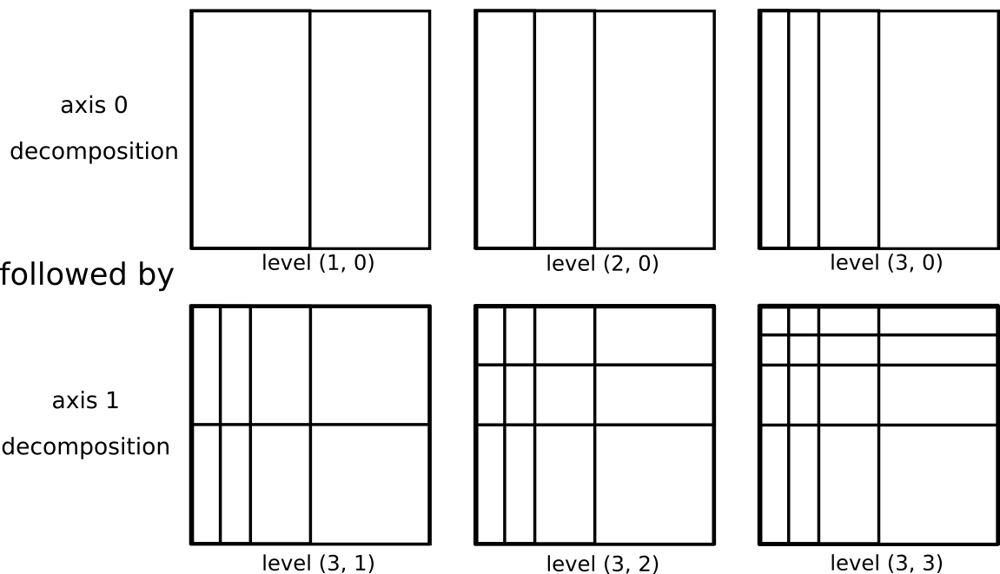

Overview of multilevel wavelet decompositions
=============================================

There are a number of different ways a decomposition can be performed for
multiresolution analysis of n-dimensional data.  Here we will review the three
approaches currently implemented in PyWavelets.  2D cases are illustrated, but
each of the approaches extends to the n-dimensional case in a straightforward
manner.

Standard Multilevel Discrete Wavelet Transform
----------------------------------------------

The most common approach to the multilevel discrete wavelet transform involves
further decomposition of only the approximation subband at each subsequent
level.  This is also sometimes referred to as the Mallat decomposition
[TODO: REF].  In 2D the discrete wavelet transform, produces four sets of
coefficients corresponding to the 4 possible compinations of the wavelet
decomposition filters over the two separate axes.  (In n-dimensions, there
are 2**n sets of coefficients).  This approach is illustrated below.

In PyWavelets it is implemented for n-dimensional data by `wavedecn` and the
inverse by `waverecn`.  1D and 2D versions of these routines also exist.

Fully Seperable Discrete Wavelet Transform
------------------------------------------
An alternative decomposition results in first fully decomposing one axis of the
data prior to moving onto each additional axis in turn.  This is illustrated
below for the 2D case.  This approach has a factor of two higher computational
cost as compared to the Mallat approach, but has advantages in compactly
representing anisotropic data.  A simple example of this can be seen in the
demo (TODO: link to Mondrian demo).

This form of the DWT is also sometimes referred to as the tensor wavelet
transform or the hyperbolic wavelet transform.  In PyWavelets it is implemented
for n-dimensional data by `fswt` and the inverse by `ifswt`.

Wavelet Packet Transform
------------------------

Another possible choice is to apply additional levels of decomposition to all
wavelet subbands from the first level as opposed to only the approximation
subband.  This is known as the wavelet packet transform and is illustrated in
2D below.

Further description is available in the wavelet packet documentation (TODO: link).

.. image:: ../_static/wavelet_packet.png
